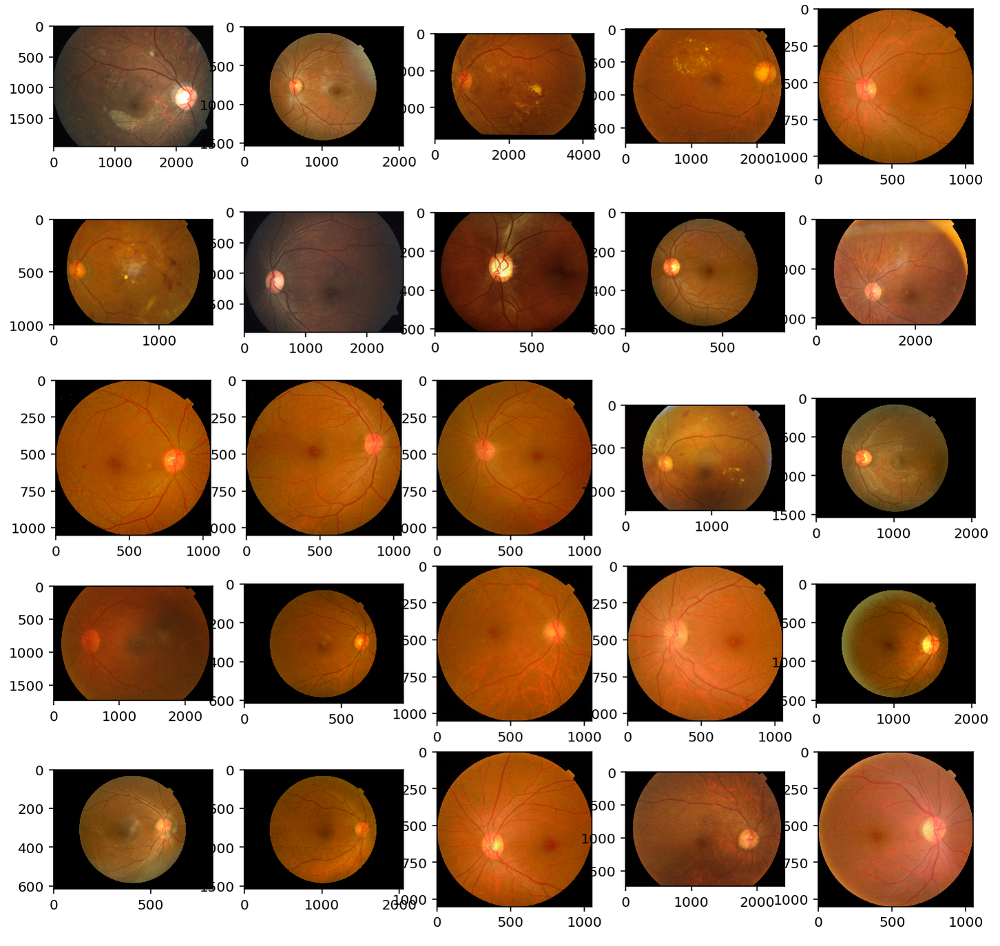
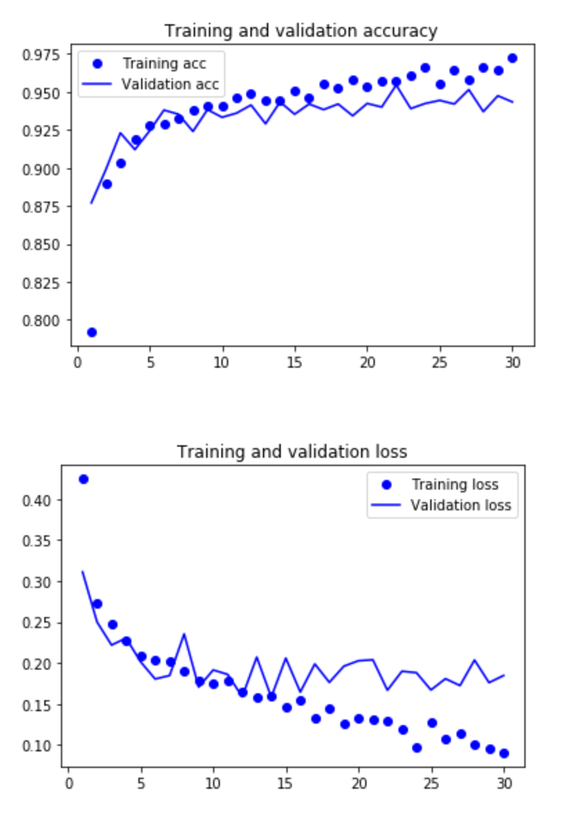

# APTOS blindness detection kaggle competition

##### Table of Contents  
[Competition_Info](#competition_info)  
[Example_Images](#img) 
[Prep](#prep) 
[Methods](#methods) 

## Competition Info <a name="competition_info"/>

In this competition, the objective is to correctly classify diabetic retinopathy in images taken using fundus photography. There are five ratings that represent the various diagnoses for each image:
 * 0 - No diabetic retinopathy (DR)
 * 1 - Mild DR
 * 2 - Moderate DR
 * 3 - Severe DR
 * 4 - Proliferative DR
 
 

## Example Images <a name="img"/>

## Preprocessing steps <a name="prep"/>
Depending on the model being built, we can do a few things to improve performance. Some of these steps are applicable to all models being built:
  1. Separate training images into different folders based on their assigned class label.
  1. Augment data by shifting, flipping, rotating, etc.
  1. Use some data from previous competition a few years ago

## Methods <a name="methods"/>
Various preprocessing methods, model architectures, and training parameters were experimented with to try to get the best kappa score.

Below are some of the approaches we can try to classify these images:
  * Train a convolutional neural network (convnet) from scrath.
  * Train a convnet from scratch but additionally augment the data by applying transformations available in keras.
  * Use a pretrained network for image classification tasks to extract features from the competition data, then feed those through only the classification layer of the convnet.
  * Use a pretrained network but train from end-to-end, which will be much more computationally expensive but allows for data augmentation which may be beneficial because we only have a few thousand images per class.
  * Use fine-tuning to freeze a few layers at a time to make the pretrained weights slightly more relevant to the current dataset without losing the generalizability of the pretrained model weights.

1. Binary classifier

